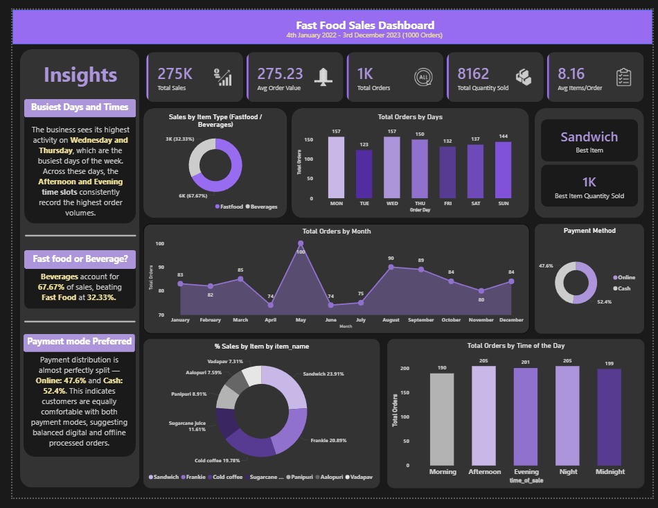

# 🍽️ Fast Food Sales Analysis — SQL + Power BI Dashboard

An end-to-end Data Analytics project analyzing over 1,000+ fast-food transactions using SQL, Power BI, and DAX.

This dashboard reveals customer behavior, demand patterns, revenue contribution, and operational insights for data-driven decision-making.

---

## 📊 Dashboard Preview



---

## 📁 Project Structure
```
PowerBI-FastFood-Sales-Analysis/
│
├── Dataset/
│   └── Balaji Fast Food Sales.csv
│
├── sql/
│   ├── create_table.sql
│   ├── cleaning_queries.sql
│   ├── kpi_queries.sql
│   └── insights_queries.sql
│
├── FAST_FOOD_HE.pbix
│  
│
├── assets/
│   └── db.png
│
└── README.md
```

---

## 🧠 Project Overview

This project analyzes real-world fast-food outlet sales to:

- Understand sales performance
- Identify top-selling items
- Analyze payment behavior
- Study peak sales days & times
- Reveal actionable business insights

The final deliverable is a fully interactive Power BI dashboard powered by SQL queries and advanced DAX measures.

---

## 🛠️ Tech Stack

| Tool | Purpose |
|------|---------|
| SQL Server (SSMS) | Data cleaning, transformation, and KPI calculation |
| Power BI | Dashboard visualization |
| DAX | Custom KPIs, time intelligence, insights |
| GitHub | Project hosting & version control |

---

## 📥 Dataset Description

The dataset contains sales records with:

- Order details
- Item & category
- Quantity
- Revenue
- Payment method
- Time of sale
- Staff who received the order

This allows multi-dimensional analysis.

---

## 📈 Key KPIs Built

🔸 Total Sales  
🔸 Total Orders  
🔸 Total Quantity Sold  
🔸 Average Order Value (AOV)  
🔸 Best-Selling Item  
🔸 Best Item Quantity Sold  
🔸 Items Per Order  
🔸 Sales by Item Type  
🔸 Orders by Day & Month  
🔸 Payment Mode Split  

All KPIs were created using SQL + DAX.

---

## 📊 Dashboard Sections

### 1. Sales KPIs
- Total Sales
- AOV
- Total Orders
- Total Quantity

### 2. Item-Level Analysis
- % Sales by Item
- Best-Selling Item
- Quantity Sold

### 3. Time-Based Analysis
- Orders by Day of Week
- Orders by Month
- Time-of-day Order Patterns

### 4. Payment Method Analysis
- Cash vs Online

---

## 🔍 Key Insights

**1️⃣** Wednesday & Thursday are the busiest days, showing mid-week traffic peaks.

**2️⃣** Afternoon & Evening are the highest-demand hours, dominating order volume.

**3️⃣** Sandwich is the top performer, contributing 23% of total revenue.

**4️⃣** Beverages account for nearly 68% of total sales, beating food items.

**5️⃣** Payment split is evenly balanced, with Cash slightly leading Online.

---

## 🚀 How to Run This Project

### 1. Clone the repository
```bash
git clone https://github.com/<yourname>/powerbi-fastfood-sales-analysis
```

### 2. Load SQL files into SSMS
- Run `create_table.sql`
- Import CSV
- Run cleaning + KPI queries

### 3. Open the Power BI file
```
FAST_FOOD_HE.pbix
```

### 4. Refresh & explore dashboard

---

## 📬 Contact

If you'd like to collaborate or discuss analytics projects:

- **Email:** tejasjaiswal5@gmail.com

---

## 🎉 Final Note

This project is a strong demonstration of data cleaning, analysis, visualization, and business storytelling — perfect for **Data Analyst** or **Business Analyst** roles.

---

⭐ **If you found this project helpful, please give it a star!**